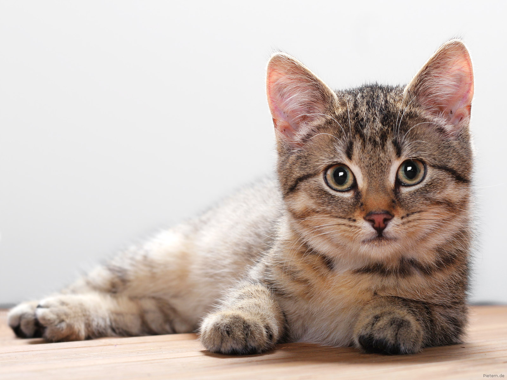
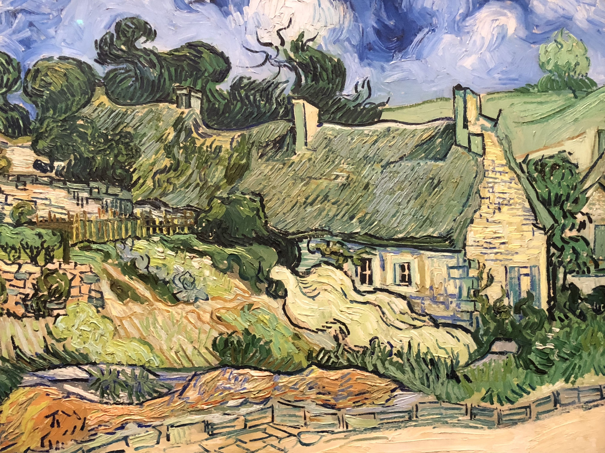
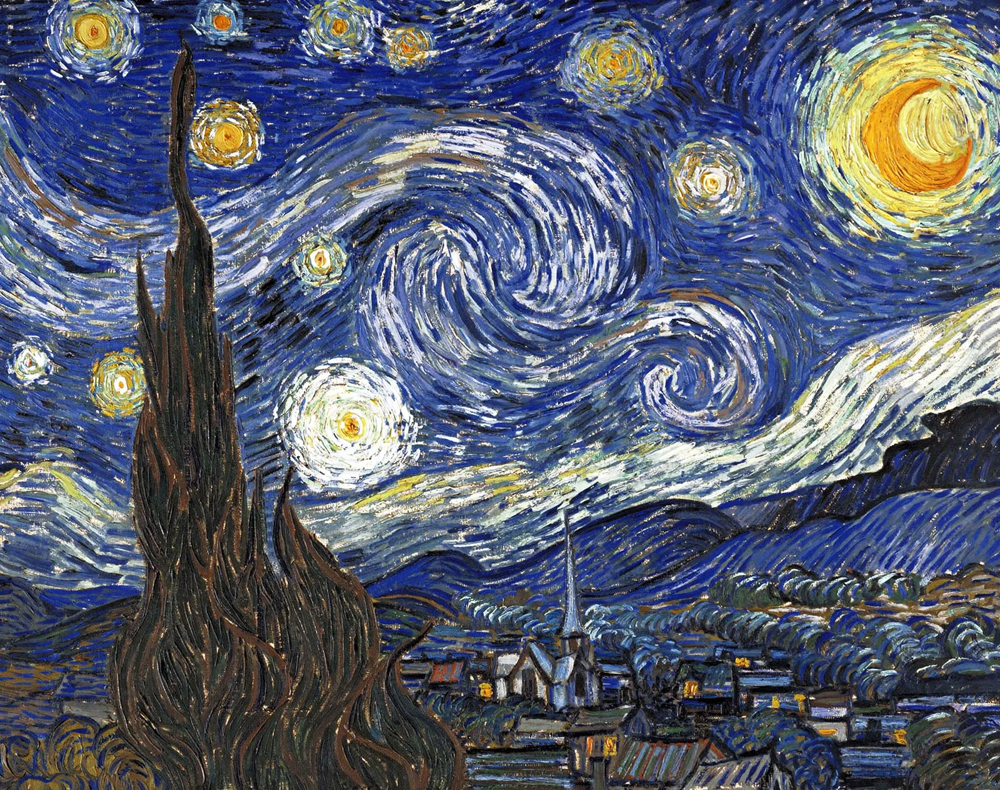
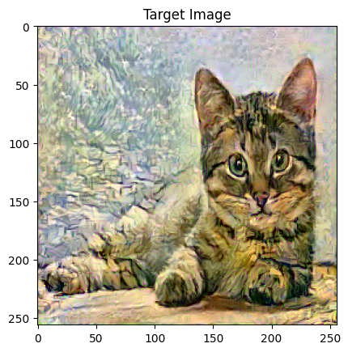
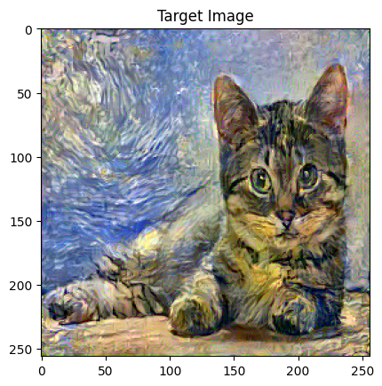

# Neural_Style_Transfer

This project demonstrates the application of Neural Style Transfer (NST) to generate artistic images by blending the content of a source image with the styles of one or more style reference images. The implementation leverages PyTorch and a pre-trained VGG16 model to extract image features and apply both content and style constraints during optimization.

## 📌 Overview
Neural Style Transfer is a technique that manipulates image textures and patterns based on convolutional neural network (CNN) features. In this project, two experimental pipelines are presented:

- Single Style Transfer – blending one style image with a content image.
- Dual Style Transfer – blending two distinct style images with a content image.

Both use VGG16's intermediate convolutional layers to represent style and content information.

## 🧠 Intuition
The model defines three core components:

- Content Loss: Measures how different the generated image is from the content image using activations from deeper layers.
- Style Loss: Computes how different the textures are from the style image using Gram matrices of shallow to deep layers.
- Total Loss: A weighted sum of content and style losses.

By minimizing the total loss with respect to the generated image (starting from the content image), we gradually transform it into an artistic rendering of the original content.

## 🛠️ Implementation Details
**Common Setup**
- Model: VGG16 pre-trained on ImageNet.
- Library: PyTorch (torchvision.models.vgg16)
- Image Size: 256×256
- Loss Functions: Mean Squared Error (MSE) for both content and style.
- Optimizer: Adam optimizer

**Gram Matrix**
Used to represent the style of an image by capturing correlations between filter responses
```
def gram_matrix(tensor):
    a, b, c, d = tensor.size() 
    tensor = tensor.view(a*b, c*d)
    G = torch.mm(tensor, tensor.t())
    return G.div(a*b*c*d)
```

## 🧪 Experiments
**Input data**




**Single Style Transfer**


**Dual Style Transfer**


## ⚙️ Training Configuration
| Parameter        | Value     |
|------------------|-----------|
| Content Weight   | 1e1       |
| Style Weight     | 1e7       |
| Optimizer        | Adam      |
| Learning Rate    | 0.02      |
| Epochs           | 3000 (Single) / 6000 (Dual) |
